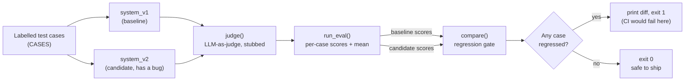

# You Can't `assert` an LLM: How to Actually Test Non-Deterministic AI

A plain-language explainer, with a runnable ~60-line example, on building evaluation harnesses for LLM systems — the single most underrated skill in AI engineering.


> **AI Engineer Roadmap — Project 6.2 ("Teach it back")**

---

## What it does

This repo is a short article plus one runnable file. The article argues that
`assert output == expected` is useless for LLM output and walks through the fix:
an **evaluation harness** — a labelled test set, automated scoring, and a
regression gate you run on every change. [`example.py`](example.py) implements
all four pieces in ~60 dependency-free lines so you can see a regression get
caught end to end.

If you've built anything on top of an LLM, you've felt this: you tweak a
prompt, the demo looks better, you ship it — and three other things quietly
break. You have no idea, because you have no way to *know*. That's the gap
this explainer closes.

---

## The four pieces

### 1. A labelled test set

A list of cases: an input, optionally a reference answer, and the **criteria** a
good answer must meet. This is the part everyone skips and the part that matters
most — without ground truth there's nothing to measure against.

```python
cases = [
    {"id": "refund", "input": "How do I get a refund?",
     "criteria": "Explains the refund steps and the time window."},
    {"id": "hours", "input": "What time do you close?",
     "reference": "9pm", "criteria": "States the closing time."},
]
```

You don't need thousands. Twenty good cases that cover your real failure modes
beat a giant vague set. Add a new case **every time something breaks in
production** — your test set becomes a memory of every bug you've fixed.

### 2. Scorers — turn an answer into a number

Two families, and you'll use both:

- **Heuristic scorers** for when there's a clear right answer: exact match,
  substring contains, regex, "is it valid JSON?". Cheap, instant, deterministic.
- **LLM-as-judge** for open-ended answers where no single string is correct. You
  ask *another* LLM to rate the output against the case's criteria on a 0–1 scale
  and explain its reasoning.

The judge sounds circular — *using an LLM to grade an LLM?* — but it works,
because **grading is easier than generating.** Deciding "does this answer explain
the refund window?" is a far simpler task than writing the answer, so a model
(even a cheaper one) is reliable at it. Give it a tight rubric and make it return
structured output:

```python
JUDGE_SYSTEM = (
    "Score the output 0.0–1.0 on whether it meets the criteria. "
    'Respond with ONLY {"score": <0..1>, "reasoning": "<one sentence>"}.'
)
```

> **Pitfall:** parse the judge's reply *defensively*. Models wrap JSON in prose,
> add code fences, or ramble. A malformed verdict should score 0 and move on, not
> crash your whole eval run.

### 3. Aggregate — one number per run

Run every case through your system, score each with every scorer, and roll it up:
**pass rate**, **mean score**, and a per-scorer breakdown. One rule pays for
itself: **a case passes only if *every* scorer passes it.** That stops a fluent,
confident, totally-wrong answer from sneaking through just because it happened to
contain the right keyword.

### 4. The regression gate — did this change help or hurt?

This is the payoff. Store the scores from your current system as a **baseline**.
After any change — new prompt, new model, refactored retrieval — run the eval
again and **diff the two runs case by case**: which cases got worse, which got
better, what's the overall delta.

Wire that into CI: if any case regressed, fail the build. Now a prompt change goes
from "I think it's fine" to **"recall dropped on 2 of 20 cases, here they are"** —
in seconds, automatically, before it reaches users.

---

## Why this is the underrated skill

Everyone obsesses over prompts and models. But the teams that ship reliable LLM
products aren't the ones with the cleverest prompts — they're the ones who can
**change** their prompts without fear, because a harness tells them within minutes
whether they improved things or regressed them. Evaluation is what turns LLM
development from vibes into engineering.

It's also the most honest signal of seniority. Anyone can demo a happy path.
Being able to say *"here is where this system fails, here's the number, and here's
the test that will catch it if it regresses"* is the difference between someone
who builds demos and someone companies pay.

## The mental model that makes it click

Think of your LLM system as a function whose output you can't predict, only
*judge*. You can't pin the output, so you pin the **judgement of the output**:

```
deterministic test:   assert f(x) == expected
LLM harness:          assert judge(f(x), criteria) >= threshold,  on a labelled set,
                      and assert no case got worse than last time
```

Same discipline as a normal test suite — labelled inputs, automated checks, a
gate on every change. You've just moved the assertion from the *output* to a
*scored judgement of the output*.

---

## Architecture

`example.py` implements the four pieces above as a single, linear pipeline —
two toy systems (`system_v1`, `system_v2`, where v2 has an introduced bug) are
each run over the same labelled cases, scored, and diffed:



`judge()` is stubbed as a deterministic substring match so the whole thing runs
offline and instantly — a real judge would call an LLM with a rubric and parse
a `{"score": ...}` response instead.

## Quickstart

No install step — the example is pure standard library.

```bash
git clone https://github.com/smafnan/teaching-eval-harnesses.git
cd teaching-eval-harnesses
python example.py
```

Actual output of the command above:

```
v1 mean score: 1.000
v2 mean score: 0.667

REGRESSION DETECTED in: japan
  japan: 1.00 -> 0.00

(A CI gate would fail the build here.)
```

The process exits with status `1` when a regression is found, so this pattern
drops straight into a CI job as a pass/fail gate.

## Project structure

```
.
├── example.py           # ~60-line runnable harness: test set, scorer, aggregate, regression gate
├── tests/
│   └── test_example.py  # pytest suite for run_eval() and the compare() regression gate
├── conftest.py           # makes example.py importable from tests/
├── README.md             # this explainer
├── LICENSE               # MIT
└── .gitignore
```

## Key design decisions

- **Stubbed judge, real structure.** `judge()` is a one-line substring check
  instead of a real LLM call, so the demo is deterministic, free, and runs in
  CI with zero network access — while still exercising the exact same
  aggregate-and-gate logic a real judge would plug into.
- **Two toy "systems," one seeded bug.** `system_v1`/`system_v2` stand in for
  "your app before/after a change." `system_v2`'s Japan/Kyoto mistake is
  planted specifically so `compare()` has something real to catch.
- **Dependency-free on purpose.** The whole point of the explainer is the
  *mental model* (test set → scorer → aggregate → gate), not a framework. Zero
  imports keeps the example copy-pasteable into any codebase.

## Limitations

- `judge()` is illustrative, not production-grade — it's a substring match,
  not a rubric-scored LLM call, and doesn't return reasoning the way a real
  judge would.
- Only three toy cases — enough to demonstrate the pattern, not enough to
  represent a real test set (the article itself recommends ~20+ cases covering
  real failure modes).

## Testing

A small, stdlib-only pytest suite in [`tests/`](tests/test_example.py) covers
`run_eval`, the happy-path `compare()` regression gate, and the mismatched-ID
edge case (missing/extra cases are reported instead of raising `KeyError`).
Run it with:

```bash
pip install pytest
pytest -q
```

## Roadmap

- A fuller, tested implementation — heuristic scorers, a real LLM-as-judge with
  pluggable providers, and a CI-ready regression gate — lives in the companion
  project: **[ai-roadmap-4.3-eval-harness](https://github.com/smafnan/ai-roadmap-4.3-eval-harness)**.

---

*Found this useful, or spotted something that made it click (or didn't)? That
feedback is the whole goal of a "teach it back" — open an issue.*
